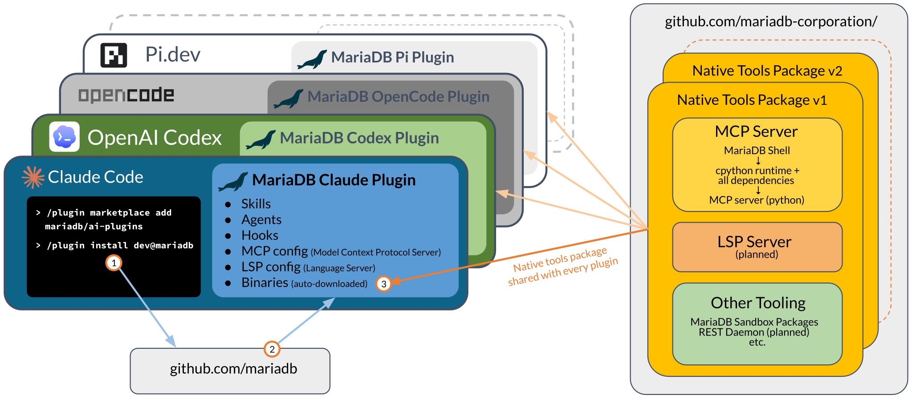

# Architecture

This page describes how MariaDB AI Plugins reach a coding agent, how their components work together, how MariaDB Shell is installed, and how the plugins are packaged for each harness.

## Overview

MariaDB AI Plugins involve three parts: the coding agent, the agent plugin, and the native tools package. The agent plugin is specific to each coding agent, while the native tools package is shared by all of them.



_A plugin is installed from GitHub (1 and 2), and downloads the native tools package for its platform on first use (3)._

### Coding Agent

The coding agent, which this documentation calls the *harness*, is the AI tool you work with: Claude Code, Codex, OpenCode, or Pi. Each coding agent has its own way of installing and loading extensions, so there is a separate MariaDB plugin for each of them.

You install the plugin with the commands of your coding agent (1). In Claude Code, for example, you add the MariaDB marketplace and install the plugin with these commands:

```text
/plugin marketplace add mariadb/ai-plugins
/plugin install dev@mariadb
```

See [Installation](installation/).

### Agent Plugin

The coding agent downloads the plugin from the [MariaDB AI Plugins repository](https://github.com/mariadb/ai-plugins) on GitHub (2). Depending on the coding agent, a plugin can contain skills, agents, hooks, and the configuration of MCP servers and language servers. The MariaDB plugins contain:

* The skills, which the agent reads when a request concerns MariaDB.
* The configuration of the `mariadb-shell` MCP server, which tells the coding agent how to start it.
* The launcher scripts, which find or install MariaDB Shell before they start the MCP server.
* For Pi, an extension that registers the MCP server with the `pi-mcp-adapter` package.

The plugin itself contains no binaries. It consists of text files only, so the same plugin works on every operating system.

### Native Tools Package

The binaries that the plugin needs are in a separate native tools package, which is published with the releases of [MariaDB Shell](https://github.com/mariadb-corporation/mariadb-shell) on GitHub. When the MCP server is started for the first time, the launcher downloads the package that matches the operating system and CPU architecture of your machine, and installs it in your user directory (3). It verifies the checksum of the package before it installs it, and needs no administrator rights.

The package contains MariaDB Shell, together with the Python runtime and all dependencies that the MCP server needs, and the MCP server itself, which runs as a MariaDB Shell plugin. Because the runtime is part of the package, the MCP server doesn't depend on a Python installation on your machine.

All plugins on a machine use the same native tools package. If you use MariaDB AI Plugins in several coding agents, MariaDB Shell is downloaded and installed only once. Each release of the package is installed in a directory of its own, so several releases can exist side by side. Each plugin release requires a minimum version of MariaDB Shell, and the launcher uses any installed release that meets it. See [The Launcher](#the-launcher).

The diagram also shows tools that aren't part of the package yet, marked as planned.

## Components

At run time, the plugin works with the following components:

| Part | What it is | Needs |
| --- | --- | --- |
| Skills | Markdown documents vendored into the plugin. The agent reads the ones whose description matches the request. | Nothing; they work offline on a fresh install. |
| MCP server | 28 tools that talk to MariaDB Server, in three groups: `db.*`, `msm.*`, and `sandbox.*`, plus the optional `migrator.*` group. | A one-time `mcp setup`, and a server to talk to. |
| MariaDB Shell | MariaDB's command-line shell. The MCP server runs inside it as a plugin. | Installed automatically on first use. |

## Why the MCP Server Runs Inside MariaDB Shell

MariaDB Shell provides database connections, a credential store that uses the secret storage of the operating system, sandbox deployment, and the schema management engine. The MCP server runs as a MariaDB Shell plugin so that it can use these functions. This has the following consequences:

* Passwords aren't stored in configuration files but in the MariaDB Shell secret store. The agent requests a connection and never sees the credentials.
* You can use the same MariaDB Shell installation as a SQL client.
* The MariaDB Shell configuration directory, `~/.mariadb-shell`, holds the shell's plugins, the secret store, and the MCP server's settings.

## The Launcher

Every plugin ships a launcher script, `mariadb-mcp-launcher.sh` and its Windows counterpart `mariadb-mcp-launcher.cmd`. The harness doesn't start MariaDB Shell directly but runs the launcher, which looks for a MariaDB Shell binary in the following order:

1. `$MARIADB_SHELL_BIN`, if set.
2. A `mariadb-shell` on the `PATH` that meets the minimum version.
3. A local install at `$MARIADB_SHELL_BINDIR/mariadb-shell`. The default is `~/.local/bin`, or `%LOCALAPPDATA%\Programs\mariadb-shell\bin\` on Windows.
4. If none of these is found, the launcher downloads and runs the official MariaDB Shell installer, `install.sh` or `install.ps1`, and uses the installed binary.

The launcher then starts the binary as `mariadb-shell -- mcp start-server --transport=stdio`.


`MARIADB_SHELL_VERSION` specifies the minimum version. If an installed binary meets this version, the launcher uses it and doesn't access the network. The launcher downloads MariaDB Shell only if no installed binary meets the minimum version. To upgrade MariaDB Shell, raise the minimum version, remove the installation that the launcher manages, or run the installer yourself.


The launcher writes all of its messages to standard error, because standard output carries the MCP protocol.

See [Configuration Reference](configuration-reference.md) for all launcher environment variables.

## How the Harnesses Differ

All harnesses get the same skills and the same MCP server, but the plugins are packaged differently:

* **Claude Code** and **Codex** read a marketplace manifest and install a plugin directory.
* **OpenCode** has no marketplace. You merge an `mcp` block into your configuration, set an environment variable, and link the skills directory.
* **Pi** has neither a marketplace nor built-in MCP support. The repository-root `package.json` is the Pi package manifest, and MCP support comes from the separately installed `pi-mcp-adapter` package.

## Vendored Skills

The skills are copied into each plugin when a release is built, rather than downloaded at run time. Each plugin release therefore contains a fixed version of the skills, tested with that release. Changes in the source repositories don't affect installed plugins until the next release. The skills come from the MariaDB documentation repository, the MariaDB Shell repository, and the MariaDB AI Plugins repository.
